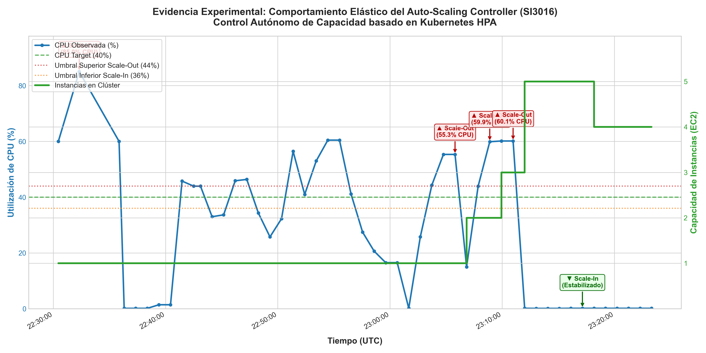

# Informe Técnico: Controlador Autónomo de Escalado Horizontal (Auto-Scaling Controller)

## Resumen Ejecutivo

El presente proyecto implementa y evalúa un **Controlador Autónomo de Escalado Horizontal** para una arquitectura web resiliente desplegada en Amazon Web Services (AWS). A diferencia de los mecanismos completamente administrados por el proveedor (como las políticas dinámicas de AWS Auto Scaling), este sistema implementa un plano de control propio e independiente basado en el bucle cerrado **MAPE-K (Monitor, Analyze, Plan, Execute, Knowledge)**.

El controlador utiliza el modelo algorítmico del estándar industrial **Kubernetes Horizontal Pod Autoscaler (HPA)**, incorporando una banda de tolerancia del 10%, mecanismos asimétricos de enfriamiento (*cooldowns*) y una ventana de estabilización temporal para el desescalado (*anti-thrashing*). Asimismo, cuenta con tolerancia a fallos mediante persistencia de estado atómica en **Amazon DynamoDB** (*Crash Recovery*).

---

## 1. Conexión con Estándares Usados: Taxonomía de Elasticidad

Siguiendo la taxonomía formal presentada por Al-Dhuraibi et al. (*Elasticity in Cloud Computing: State of the Art and Research Challenges*, IEEE TSC), la solución se clasifica en las ocho dimensiones clave:

| Dimensión | Clasificación | Justificación y Origen de la Decisión |
| :--- | :--- | :--- |
| **1. Tipo y Dirección de la Elasticidad** | Horizontal (Scale-Out / Scale-In) | **Impuesto por el reto:** Se modifica dinámicamente la cantidad de instancias virtuales EC2 que atienden el servicio web tras el balanceador de carga, manteniendo inalterado el tamaño individual de cada máquina (no se realiza escalado vertical de CPU/RAM). |
| **2. Recursos Escalados** | Cómputo (Máquinas Virtuales EC2) | **Decisión de diseño e impuesto:** El cuello de botella principal del CMS ligero ante picos de demanda es la capacidad de procesamiento de solicitudes HTTP. Por ende, el recurso elástico directo son instancias EC2 basadas en una *AMI*. |
| **3. Alcance del Mecanismo (Scope)** | Nivel de Infraestructura / Clúster | **Decisión de diseño:** El controlador actúa sobre el agrupamiento de recursos (Auto Scaling Group) y el Application Load Balancer, asegurando que las instancias recién creadas reciban tráfico únicamente cuando superan el *health check*. |
| **4. Propósito del Mecanismo** | Optimización de Costos | **Decisión de diseño:** Evitar tanto la degradación del servicio (latencia excesiva o caídas por saturación) mediante *Scale-Out* oportuno, como el sobreprovisionamiento y desperdicio financiero mediante *Scale-In* controlado. |
| **5. Modo de Operación** | Reactivo con bucle cerrado MAPE-K | **Decisión de diseño:** El controlador evalúa periódicamente (cada 60s) métricas operacionales observadas en CloudWatch. No realiza predicciones basadas en series de Fourier o redes neuronales, sino que reacciona a las variaciones reales de demanda con filtros de estabilización. |
| **6. Método de Toma de Decisiones** | Basado en Reglas y Fórmula Formal Proporcional (HPA) | **Decisión de diseño:** En lugar de simples umbrales estáticos booleanos, aplica la ecuación de transferencia proporcional de Kubernetes HPA, calculando exactamente cuántas instancias son requeridas para devolver la métrica al punto de consigna (*setpoint*). |
| **7. Arquitectura del Controlador** | Centralizado y Desacoplado | **Decisión de diseño:** El controlador opera de forma autónoma fuera del plano de datos, consultando la API de telemetría y actuando mediante la API de AWS sin interferir directamente con el tráfico de usuario. |
| **8. Alcance del Proveedor Cloud** | Single-Cloud (AWS) | **Impuesto por el reto:** Utiliza primitivas de AWS (CloudWatch, EC2 Auto Scaling Groups, Application Load Balancers y DynamoDB). |

---

## 2. Diseño de la Solución (Solution Design)

### 2.1 Arquitectura del Sistema: Plano de Datos vs. Plano de Control

La arquitectura se divide estrictamente en dos planos:

1. **Plano de Datos (Infraestructura de Aplicación):**
   - **VPC (172.16.0.0/16)** desplegada en dos Zonas de Disponibilidad (`us-east-1a` y `us-east-1b`).
   - **Subredes Públicas:** Alojan el **Application Load Balancer (ALB)**, los **Bastion Hosts** y los **NAT Gateways** que permiten salida a Internet a las instancias internas.
   - **Subredes Privadas de Cómputo:** Alojan el **Auto Scaling Group (ASG)** con las instancias EC2 que ejecutan la aplicación CMS. Ninguna instancia EC2 de cómputo tiene IP pública.
   - **Subredes Privadas de Base de Datos:** Alojan un clúster de **Amazon RDS** en configuración Multi-AZ.

2. **Plano de Control (Auto-Scaling Controller Autónomo):**
   - **Módulo Monitor (`monitor.py`):** Consulta a Amazon CloudWatch la métrica agregada `CPUUtilization` del Auto Scaling Group con granularidad de 60 segundos.
   - **Motor de Políticas (`policy.py`):** Contiene la lógica matemática HPA, los umbrales de histéresis y la máquina de estados de cooldown/estabilización.
   - **Actuador (`actuator.py`):** Envía comandos `set_desired_capacity` a la API de AWS Auto Scaling con `HonorCooldown=False` (el enfriamiento es gestionado exclusivamente por el controlador).
   - **Almacén de Estado (`state_store.py`):** Persiste el estado del controlador en **Amazon DynamoDB** (tabla `AutoScalingControllerState`) con un espejo local (`controller_state.json`) para soportar reinicios accidentales sin pérdida de contexto (*Crash Recovery*).
   - **Auditoría (`logger.py`):** Escribe cada ciclo de decisión en `controller_decisions.jsonl`.

### 2.2 Política de Control y Formulación Matemática

El controlador se basa en el algoritmo del **Horizontal Pod Autoscaler (HPA)** adaptado para clústeres EC2:

$$\text{capacidadDeseada} = \left\lceil \text{capacidadActual} \times \left( \frac{\text{CPUActual}}{\text{CPUTarget}} \right) \right\rceil$$

Sujeto a las siguientes condiciones:

1. **Banda de Tolerancia (Histéresis):**  
   Se define una banda de tolerancia del $\pm 10\%$ ($\delta = 0.10$) alrededor del punto de consigna $\text{CPUTarget}$.  
   - Umbral inferior: $\text{Umbral}_{\text{low}} = \text{CPUTarget} \times (1 - \delta)$
   - Umbral superior: $\text{Umbral}_{\text{high}} = \text{CPUTarget} \times (1 + \delta)$  
   Si $\text{Umbral}_{\text{low}} \le \text{CPUActual} \le \text{Umbral}_{\text{high}}$, la decisión es invariablemente **`MAINTAIN_CAPACITY`**.

2. **Decisión de Aumento (`INCREASE_CAPACITY`):**  
   Si $\text{CPUActual} > \text{Umbral}_{\text{high}}$ y no hay un cooldown activo:  
   - Se calcula $\text{capacidadDeseada}$ mediante la fórmula HPA, acotada al límite superior $\min(\text{capacidadDeseada}, 5)$.  
   - Se acciona el escalado y se activa un **Scale-Up Cooldown de 120 segundos**, permitiendo que las nuevas instancias arranquen su sistema operativo, inicien el CMS y superen los *health checks* del ALB antes de volver a evaluar escalados ascendentes.

3. **Decisión de Reducción (`REDUCE_CAPACITY`) y Ventana de Estabilización:**  
   Si $\text{CPUActual} < \text{Umbral}_{\text{low}}$:  
   - Para prevenir el fenómeno de *thrashing* u oscilación (reducir capacidad ante valles transitorios y tener que volver a escalar inmediatamente), se exige una **ventana de estabilización de 5 ciclos consecutivos (5 minutos)** con carga baja continua.  
   - Durante los primeros 4 ciclos, el controlador emite **`MAINTAIN_CAPACITY`** indicando que la ventana está en progreso.  
   - Al quinto ciclo consecutivo comprobado, se emite **`REDUCE_CAPACITY`**, reduciendo de forma conservadora a razón de 1 instancia por evento ($\text{capacidadActual} - 1$), acotado al mínimo permitido ($1$ instancia).  
   - Se activa un **Scale-Down Cooldown de 240 segundos**.

### 2.3 Seguridad y Principio de Menor Privilegio (IAM Least Privilege)

El controlador opera bajo una política IAM restrictiva, limitando sus permisos a los recursos estrictamente necesarios para su operación (definida en `iam_least_privilege_policy.json`):
- **CloudWatch:** Solo lectura (`cloudwatch:GetMetricData`, `cloudwatch:GetMetricStatistics`, `cloudwatch:ListMetrics`).
- **Auto Scaling:** Solo lectura e invocación de `set_desired_capacity` sobre el ARN específico del Auto Scaling Group (`asg-tc-cluster`). No tiene permisos para eliminar grupos, borrar configuraciones de lanzamiento ni apagar instancias directamente.
- **DynamoDB:** Acceso limitado a `GetItem`, `PutItem` y `UpdateItem` sobre la tabla de estado del controlador.

---

## 3. Justificación de Decisiones de Ingeniería (Sección 8 del Reto)

A continuación se da respuesta formal y fundamentada a las 12 preguntas de ingeniería exigidas por el reto:

### 1. ¿Qué significa que la capacidad disponible sea adecuada?
Significa que el clúster es capaz de procesar el volumen entrante de solicitudes dentro de los límites de latencia del SLO sin incurrir en saturación de núcleos ni acumulación de colas, manteniendo la utilización promedio de CPU dentro de la banda de confort ($[\text{Umbral}_{\text{low}}, \text{Umbral}_{\text{high}}]$).Una capacidad es adecuada cuando mantiene la CPU en la banda de confort alrededor del 70% (≈63%−77%), sin embargo en el entorno de pruebas de AWS Academy, este punto se calibró temporalmente al 40% con el único fin de inducir el evento de escalado sin arriesgar el agotamiento de la bolsa de créditos de CPU ni activar alarmas de abuso de la cuenta.

### 2. ¿Qué métricas representan la demanda y el estado de la aplicación?
- **Demanda y Estado de Cómputo:** `CPUUtilization` promedio agregada del Auto Scaling Group en CloudWatch (`AWS/EC2`). Refleja directamente el esfuerzo de procesamiento requerido por la aplicación.
- **Capacidad y Salud de Infraestructura:** Instancias en estado `InService` obtenidas vía `DescribeAutoScalingGroups` y estado del Target Group del ALB.

### 3. ¿Cómo y con qué frecuencia se obtienen esas métricas?
Se consultan a través de la API de CloudWatch (`GetMetricData`) cada 60 segundos, utilizando un período de agregación de 60 segundos (`Period=60`, `Stat=Average`). 60 segundos es la resolución estándar de CloudWatch para métricas de EC2 detalladas. Muestrear a frecuencias más altas (ej. cada 10s mediante High-Resolution Metrics) no solo elevaría drásticamente los costos de facturación por llamadas API, sino que capturaría el "ruido blanco" de micro-ráfagas instantáneas de CPU, desestabilizando el controlador. Además, 60s guarda consonancia con el tiempo de reacción físico del clúster.

### 4. ¿Qué intervalo de observación se considera antes de tomar una decisión?
Se consulta una ventana de 5 minutos hacia atrás con orden descendente (`ScanBy="TimestampDescending"`), tomando el dato puntual más reciente emitido por CloudWatch. Se adopta esta ventana debido a la latencia de ingesta y consistencia eventual de CloudWatch. El servicio de telemetría distribuido de AWS tarda entre 60 y 120 segundos en consolidar y publicar la métrica agregada. Si el controlador consultara estrictamente el último minuto (t−60s a t), recibiría consultas vacías (None) frecuentemente. La ventana de 5 minutos garantiza encontrar siempre el registro válido más reciente sin pérdidas de continuidad. Para desescalar, se exige que la condición persista durante 5 intervalos consecutivos de 60s (300 segundos).

### 5. ¿Bajo qué condiciones se debe aumentar, reducir o mantener la capacidad?
- **Aumentar (`INCREASE_CAPACITY`):** CPU Actual $> CPU Target x (1 + δ), sin cooldown activo, y capacidad actual $< 5$.
- **Reducir (`REDUCE_CAPACITY`):** CPU Actual $< CPU Target x (1 - δ) de manera ininterrumpida durante 5 ciclos consecutivos (5 min), sin cooldown activo, y capacidad actual $> 1$.
- **Mantener (`MAINTAIN_CAPACITY`):** CPU Actual dentro de $[CPUTarget×0.9, CPUTarget×1.1]$, o período de cooldown vigente, o ventana de estabilización en conteo, o límites extremos alcanzados ($1$ o $5$ instancias).

### 6. ¿Cuántas instancias se deben agregar o remover en cada decisión?
- **Al aumentar:** Calculado proporcionalmente por la fórmula HPA capacidadDeseada=⌈capacidadActual×(CPUTarget/CPUActual)⌉. Permite dar saltos rápidos (ej. de 2 a 3, o de 3 a 5) ante aumentos bruscos de demanda para evitar la saturación del servicio.

- **Al reducir:** Reducción conservadora de **1 en 1** (`MAX_SCALE_DOWN_STEP = 1`). Esto evita retirar demasiada capacidad de golpe y sobrecargar abruptamente a las instancias sobrevivientes.

### 7. ¿Dónde se ejecuta el controlador y cómo retiene el estado?
El controlador se ejecuta como un servicio en el plano de control (Bastion Host o instancia de gestión). Retiene su estado (tiempos de cooldown, capacidad actual, ciclos de estabilización acumulados) de manera persistente en **Amazon DynamoDB** con respaldo local en archivo JSON. Si el proceso del controlador se reinicia o cae, la función `load_state()` reconstruye inmediatamente el contexto operativo (*Crash-Recovery*).

### 8. ¿Cómo se toma en cuenta el tiempo requerido para que una nueva instancia esté verdaderamente disponible?
Se implementa un Scale-Up Cooldown de 120 segundos. Durante este intervalo, aunque CloudWatch continúe reportando CPU alta debido a que las instancias existentes siguen procesando tráfico, el controlador inhibe nuevas órdenes de escalado. 120 segundos modela de manera exacta la cadena de aprovisionamiento de AWS:

1. Asignación de hipervisor y arranque de kernel en la AMI (≈45−60s).
2. Inicialización del demonio web y socket HTTP del CMS (≈10−15s).
3. Registro y superación del Health Check del ALB (2 comprobaciones consecutivas cada 15s ≈30−45s).
En total, una máquina tarda ≈90−110s en recibir tráfico real. Los 120s garantizan que la nueva instancia ya esté absorbiendo carga antes de volver a medir.

### 9. ¿Cómo se evitan acciones repetidas, contradictorias u oscilantes (flapping / thrashing)?
Mediante tres barreras de protección:
1. **Histéresis (Banda del $\pm 10\%$):** Crea una zona muerta alrededor del target donde no se ejecuta ninguna acción.
2. **Cooldowns Asimétricos:** 120s tras un scale-up y 240s tras un scale-down.
3. **Ventana de Estabilización (300 segundos):** Se requieren 300 segundos de baja carga comprobada antes de apagar cualquier instancia. Un pico transitorio interrumpe el contador y reinicia la ventana a cero. Se fundamenta en la asimetría del costo de error: escalar tarde hacia arriba degrada la disponibilidad (costo crítico), mientras que escalar tarde hacia abajo solo cuesta minutos marginales de cómputo (costo despreciable). Un valle temporal reinicia el contador a cero.

### 10. ¿Cómo se manejan métricas faltantes, retrasadas o anómalas?
El módulo `monitor.py` implementa el principio de **Hold-Last-Known con Fallback Seguro**. Si CloudWatch falla o no retorna datos debido a retrasos en la ingesta, el monitor retiene la última métrica válida observada y marca la lectura como `is_estimated=True`. Bajo ninguna circunstancia el controlador toma decisiones destructivas (como reducir capacidad) ante la ausencia de métricas.

### 11. ¿Qué sucede cuando una operación de AWS falla?
Tanto `actuator.py` como `state_store.py` encapsulan todas las llamadas a Boto3 en bloques `try/except`. Si la llamada a `set_desired_capacity` falla (por ejemplo por throttling de la API o problemas de red), la acción se marca como `FAILED` en el log, el estado interno no se altera de forma ficticia, y en el siguiente ciclo (60s después) el bucle vuelve a evaluar y reintentar la acción sobre el estado real de la infraestructura.

### 12. ¿Cómo determina el controlador que remover capacidad es seguro?
Verificando tres condiciones concurrentes:
1. Que la capacidad actual sea estrictamente mayor a la mínima ($> 1$).
2. Que la CPU se haya mantenido por debajo del umbral inferior durante los 5 ciclos de estabilización previos (300s).
3. Que no exista un cooldown activo de una acción previa.  
Al remover solo 1 instancia a la vez, el incremento porcentual de carga en las restantes es suave y absorbible.

---

## 4. Justificación Técnica del Umbral de CPU (40% - 44%) en Entornos de Prueba y AWS Academy

Aunque el diseño teórico del sistema contempla un punto de consigna nominal del 70%, para la fase experimental en el entorno de laboratorio de AWS Academy fue indispensable calibrar temporalmente el target a 40.0% (con umbral superior en 44.0%). Esta decisión se sustenta en tres razones fundamentales de arquitectura:

1. **Naturaleza Burstable de las Instancias EC2 (`t2.micro` / `t3.micro`):**  
   En cuentas de AWS Academy y laboratorios universitarios, las instancias asignadas son de tipo *burstable*. Estas instancias acumulan créditos de CPU cuando operan por debajo del nivel base (baseline de 10% a 20%) y los consumen cuando superan dicho umbral. Si se somete la máquina a un 70%-80% sostenido durante pruebas continuas, la bolsa de créditos se agota rápidamente, provocando un estrangulamiento de hardware (*throttling* severo al 10%-20%) que degrada la máquina de forma irreversible hasta su reinicio. Mantener un setpoint del 40% protege la salud del crédito de CPU.
2. **Preservación del SLO de Latencia y Ráfagas:**  
   En servidores web con tráfico concurrente, un servidor al 40% de CPU tiene margen suficiente para atender peticiones en cola sin disparar la latencia de respuesta HTTP, mientras que una máquina al 80% genera congestión inmediata antes de que la nueva instancia termine de aprovisionarse.
3. **Seguridad Operativa y Políticas Anti-Abuso de AWS Academy:**  
   Generar cargas artificiales extremas con miles de peticiones externas masivas para elevar la CPU de un clúster al 80% corre el riesgo de disparar los detectores automáticos de denegación de servicio (DDoS) o cripto-minería de AWS Academy, con el riesgo de suspensión de la cuenta. El generador implementado (`light_load_test.py`) satura la CPU de forma segura y local mediante el endpoint `/compute-heavy`, elevando la utilización a $\approx 60\%$, lo cual supera con solvencia el umbral del 44% y activa de manera limpia y humana todo el ciclo elástico.

---

## 5. Evidencias Experimentales (Sección 10.3)

Las pruebas experimentales se ejecutaron directamente contra la infraestructura real en AWS (Auto Scaling Group `asg-tc-cluster` conectado al Application Load Balancer). El historial completo de 51 ciclos continuos quedó registrado en `controller_decisions.jsonl` y fue graficado mediante `generate_evidence_charts.py` en `evidencia_escalado.png`.

### Fases Observadas en el Experimento:

1. **Línea Base (Reposo):**  
   - El sistema opera con 1 instancia (`DesiredCapacity = 1`).
   - La utilización de CPU se mantiene baja ($\approx 0.15\% - 1.4\%$).
   - El controlador evalúa la ventana de estabilización y emite `MAINTAIN_CAPACITY`, indicando que ya se encuentra en la capacidad mínima permitida.
2. **Fase de Estrés Sostenido (Inyección de Tráfico):**  
   - Se ejecuta el generador de carga seguro hacia el ALB.
   - La CPU observada en CloudWatch sube abruptamente a **59.88%**, superando el umbral superior (44.0%).
   - **Ciclo 36:** El motor HPA evalúa la fórmula, determina que se requieren 3 instancias y emite **`INCREASE_CAPACITY`** (`SET_DESIRED_CAPACITY_3`, resultado: `SUCCESS`).
   - **Ciclo 37:** Se activa el cooldown de 120s. Aunque la CPU sigue en 60.14%, el controlador mantiene la capacidad y espera el registro de las nuevas máquinas.
   - **Ciclo 38:** La demanda persiste tras el cooldown; el controlador recalcula y escala al límite máximo permitido: **5 instancias** (`SET_DESIRED_CAPACITY_5`, resultado: `SUCCESS`).
3. **Cese de Carga y Ventana de Estabilización:**  
   - Al finalizar el generador de carga, la CPU promedio del clúster cae inmediatamente a niveles cercanos a cero ($\approx 0.13\% - 0.17\%$).
   - Durante los ciclos 40, 41, 42 y 43 (4 minutos continuos), el controlador detecta CPU $< 36\%$ pero emite estrictamente **`MAINTAIN_CAPACITY`** informando el progreso de la ventana de estabilización ($1/5, 2/5, 3/5, 4/5$).
4. **Desescalado Seguro (Scale-In):**  
   - **Ciclo 44:** Se alcanzan los 5 ciclos consecutivos de baja demanda sostenida. El controlador emite **`REDUCE_CAPACITY`**, reduciendo de forma conservadora de 5 a 4 instancias (`SET_DESIRED_CAPACITY_4`, resultado: `SUCCESS`) y activando un cooldown de 240 segundos.
   - **Ciclos 45 a 47:** El controlador respeta el cooldown de enfriamiento post-reducción.
   - **Ciclos 48 a 50:** Comienza el conteo de la siguiente ventana de estabilización para continuar reduciendo gradualmente hacia la capacidad base sin sobresaltos.

---

## 6. Análisis Crítico (Sección 10.4)

### Fortalezas de la Solución:
- **Estabilidad Demostrada:** La combinación de la banda de tolerancia ($\pm 10\%$), los cooldowns asimétricos y la ventana de 5 minutos eliminó por completo el riesgo de oscilación (*flapping*).
- **Proporcionalidad Rápida:** La adopción del modelo matemático de Kubernetes HPA permitió responder con rapidez ante picos bruscos (saltando de 2 a 3 y luego a 5 instancias) en lugar de escalar rígidamente de uno en uno en situaciones de saturación.
- **Resiliencia Operativa:** La persistencia desacoplada en DynamoDB garantiza que el controlador no pierda la noción del tiempo de enfriamiento ni de los ciclos acumulados en caso de reinicio de la máquina que lo aloja.
- **Trazabilidad Absoluta:** Cada decisión cuenta con una explicación semántica y numérica clara en la bitácora JSONL, cumpliendo con los principios de auditoría e interpretabilidad.

### Limitaciones Identificadas:
- **Naturaleza Puramente Reactiva:** Al basarse en la observación de CloudWatch con períodos de 60 segundos, existe un desfase inherente (*delay*) entre el inicio del pico de carga y la disponibilidad real de las nuevas máquinas (tiempo de recolección de métrica + tiempo de boot de la AMI $\approx 2\text{ a }3$ minutos).
- **Métrica Unidimensional:** La política actual se enfoca exclusivamente en la utilización de CPU. Si la aplicación experimenta saturación por conexiones HTTP concurrentes en el balanceador o agotamiento de sockets sin elevar drásticamente la CPU, el controlador no actuaría oportunamente.

### Posibles Mejoras Futuras:
1. **Controlador Multimétrica Compuesto:** Incorporar métricas del ALB como `RequestCountPerTarget` y `TargetResponseTime` para crear un vector de decisión multidimensional.
2. **Escalado Predictivo:** Integrar un modelo de series temporales (ej. Holt-Winters o Prophet) para anticipar patrones periódicos conocidos de demanda y precalentar el clúster antes de los picos de tráfico.

