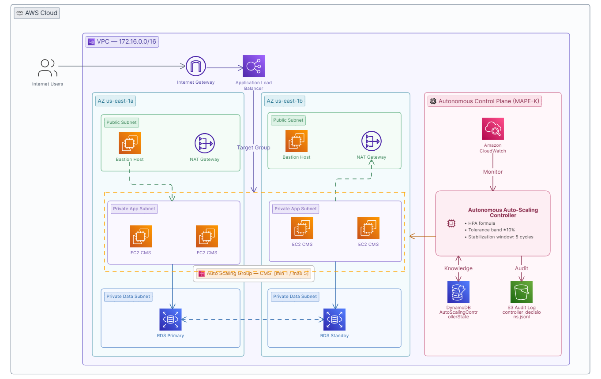

# Autonomous Multi-Metric Auto-Scaling Controller (SI3016)

Controlador autónomo de escalado horizontal para aplicaciones web en AWS EC2, desarrollado como solución al reto **Build Your Own Auto-Scaling Controller (Challenge Based Learning No. 1)** del curso de **Cloud Computing (SI3016)** en la **Universidad EAFIT**.

El controlador implementa un bucle cerrado de control (**MAPE-K**) con **criterio multi-métrica** que combina:
1. **Saturación de Hardware:** `CPUUtilization` promedio agregada del Auto Scaling Group (`AWS/EC2`).
2. **Throughput de Demanda / Workload:** `RequestCountPerTarget` en el Application Load Balancer (`AWS/ApplicationELB`).

Aplica la formulación formal del estándar industrial **Kubernetes Horizontal Pod Autoscaler (HPA)** para múltiples métricas y acciona la capacidad deseada del Auto Scaling Group sin recurrir a políticas dinámicas gestionadas por AWS.

> 📄 **Documentación Técnica Completa:** Consulta el informe formal detallado con la Taxonomía de Elasticidad, justificación de las 12 decisiones de ingeniería, análisis crítico y sustentación oral en [DOCUMENTACION_ENTREGABLE.md](DOCUMENTACION_ENTREGABLE.md).

---

## 🏛️ Arquitectura del Sistema y Caso de Uso



El sistema se divide estrictamente en dos planos:
1. **Plano de Datos:** VPC multi-AZ con subredes públicas (ALB, Bastion Hosts, NAT Gateways), subredes privadas de cómputo con Auto Scaling Group de 1 a 5 instancias EC2 (ejecutando `cms_app.py`), y subredes de datos con Amazon RDS Multi-AZ.
2. **Plano de Control Desacoplado (MAPE-K):**
   - **Monitor (`monitor.py`):** Consulta telemetría en CloudWatch para `CPUUtilization` y `RequestCountPerTarget` con período de 60s y tolerancia a fallos (*Hold-Last-Known*).
   - **Policy Engine (`policy.py`):** Aplica la regla multi-métrica de Kubernetes HPA:
     $$\text{capacidadDeseada} = \max_i \left( \left\lceil \text{capacidadActual} \times \left( \frac{\text{métricaActual}_i}{\text{métricaTarget}_i} \right) \right\rceil \right)$$
     con banda de tolerancia del $\pm 10\%$, cooldowns asimétricos y ventana de estabilización de 5 ciclos (300s) para scale-down.
   - **Actuator (`actuator.py`):** Modifica la capacidad deseada del Auto Scaling Group mediante `set_desired_capacity` con `HonorCooldown=False`.
   - **State Store (`state_store.py`):** Persiste el estado de cooldowns y estabilización en **Amazon DynamoDB** (con respaldo local) para garantizar recuperación ante caídas (*Crash Recovery*).
   - **Logger (`logger.py`):** Emite registros estructurados en JSONL (`controller_decisions.jsonl`) cumpliendo el formato del reto (`MAINTAIN_CAPACITY`, `INCREASE_CAPACITY`, `REDUCE_CAPACITY`).

---

## ⚙️ Parámetros de Configuración

Configurables en `config.py` o mediante variables de entorno:

| Variable | Descripción | Valor por Defecto |
| :--- | :--- | :--- |
| `AWS_REGION` | Región de AWS | `us-east-1` |
| `ASG_NAME` | Nombre del Auto Scaling Group | `asg-tc-cluster` |
| `DYNAMODB_TABLE_NAME` | Tabla de persistencia de estado | `AutoScalingControllerState` |
| `TARGET_CPU_UTILIZATION` | Objetivo de CPU de diseño nominal | `70.0%` (Sobrescribible con `TARGET_CPU`) |
| `TARGET_REQUEST_COUNT_PER_TARGET` | Objetivo de peticiones/minuto por instancia | `100.0` (Sobrescribible con `TARGET_REQUESTS_PER_TARGET`) |
| `ENABLE_MULTI_METRIC` | Activa la evaluación conjunta de requests ALB | `true` |
| `TOLERANCE_BAND` | Banda de estabilidad HPA | `0.10` ($\pm 10\%$) |
| `SCALE_UP_COOLDOWN_SECONDS` | Enfriamiento tras aumentar capacidad | `120s` (Tiempo de arranque y health check de AMI) |
| `SCALE_DOWN_COOLDOWN_SECONDS` | Enfriamiento tras reducir capacidad | `240s` |
| `SCALE_DOWN_STABILIZATION_CYCLES` | Ciclos requeridos para scale-down | `5` (5 minutos / 300s estándar Kubernetes) |
| `MIN_CAPACITY` / `MAX_CAPACITY` | Fronteras de capacidad exigidas | `1` a `5` instancias |

---

## 📊 Evidencias Experimentales (Telemetría Directa de AWS)

Las evidencias del comportamiento elástico provienen directamente de la infraestructura en AWS (CloudWatch y EC2 Auto Scaling Group). En el informe formal [DOCUMENTACION_ENTREGABLE.md](DOCUMENTACION_ENTREGABLE.md) se analizan las capturas tomadas de la consola de AWS:

1. **Utilización de CPU en Amazon CloudWatch (`aws_cloudwatch_cpu.png`):** Curva de esfuerzo de cómputo durante la fase de carga.
2. **Capacidad de Instancias en Auto Scaling Group (`aws_asg_capacity.png`):** Escalón de crecimiento de 1 a 3 y a 5 instancias, período de estabilización y desescalado seguro a 4 instancias.
3. **Auditoría de Decisiones (`controller_decisions.jsonl`):** Bitácora de 51 ciclos continuos que certifica cada transición del bucle cerrado.

---

## 🚀 Instalación y Ejecución

### 1. Requisitos Previos
- Python 3.8+
- Instalar dependencias:
  ```bash
  pip install -r requirements.txt
  ```

### 2. Configurar Credenciales de AWS
En entornos de AWS Academy, copia las credenciales temporales desde la consola:
```bash
# Linux / macOS:
export AWS_ACCESS_KEY_ID="ASI..."
export AWS_SECRET_ACCESS_KEY="..."
export AWS_SESSION_TOKEN="..."
export AWS_DEFAULT_REGION="us-east-1"

# Windows PowerShell:
$env:AWS_ACCESS_KEY_ID="ASI..."
$env:AWS_SECRET_ACCESS_KEY="..."
$env:AWS_SESSION_TOKEN="..."
$env:AWS_DEFAULT_REGION="us-east-1"
```

### 3. Ejecutar el Controlador
```bash
# Ejecución continua en producción (ciclos de 60 segundos):
python main.py

# Ejecución con target calibrado para pruebas de laboratorio (ej. 40% CPU):
# Linux: TARGET_CPU=40.0 python main.py
# Windows: $env:TARGET_CPU="40.0"; python main.py

# Ejecución de prueba con telemetría simulada (offline):
python main.py --once --simulate-cpu 85.0 --simulate-requests 150.0
```

### 4. Prueba de Carga Segura (AWS Academy Safe)
Genera carga controlada hacia el ALB saturando la CPU de forma local sin disparar alarmas de tráfico anómalo:
```bash
python light_load_test.py --alb-url "http://<DNS-DEL-ALB>" --duration-min 3
```

---

## 🔒 Seguridad y Principio de Menor Privilegio

El controlador opera bajo una política IAM restrictiva de solo lectura en CloudWatch, lectura de Target Groups de ALB, invocación acotada sobre el ARN del Auto Scaling Group y acceso granular a DynamoDB. Consulta la política completa en [iam_least_privilege_policy.json](iam_least_privilege_policy.json).

---

## 📋 Estructura de Archivos del Repositorio

```
Controller/
├── DOCUMENTACION_ENTREGABLE.md   # Informe técnico formal completo (Secciones 5, 8, 10.1, 10.4 y 12)
├── README.md                     # Guía de inicio rápido y arquitectura
├── iam_least_privilege_policy.json # Política IAM de menor privilegio
├── config.py                     # Configuración y parámetros desacoplados multi-métrica
├── main.py                       # Bucle continuo MAPE-K (observe -> analyze -> decide -> act)
├── monitor.py                    # Sensor CloudWatch multi-métrica con resiliencia Hold-Last-Known
├── policy.py                     # Algoritmo HPA multi-métrica, histéresis y estabilización
├── actuator.py                   # Actuador Boto3 para Auto Scaling Group
├── state_store.py                # Persistencia en DynamoDB (Crash Recovery)
├── logger.py                     # Auditoría estructurada de decisiones
├── controller_decisions.jsonl    # Registro de 51 ciclos reales de experimentación en AWS
├── DiagramaCasoDeUso.png         # Diagrama de arquitectura y caso de uso
├── cms_app.py                    # Aplicación web Flask servida en la Golden AMI
├── light_load_test.py            # Generador de carga seguro para pruebas
└── requirements.txt              # Dependencias de Python
```
